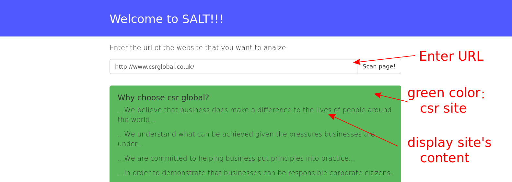

## Hackathon Coffee and Coding 2017 Groningen
Team Salt: Lalit, Ashish, Thijs and Sijmen

1st place!

### The challange by dataprovider.com

*Create a service that can convert unstructured HTML into some good looking text and classify it! Create a service that can convert content from HTML pages into a neat text that can be recognised and classified. The Safari's reader display is a good example of a script that converts HTML into a neat looking text (images attached). You need to classify the subject of the text. In this challenge, in principle we will restrict ourselves to the classification (yes or no) of a CSR or in Dutch MVO
(corporate social responsibility in dutch maatschappelijk verantwoord ondernemen) text but if you have a lot of time left and more interesting ideas please do implement them!!*

*To parse the text, you should not only look at markup `<h1> 
` but really recognise the sentences, headings and paragraphs. For example, you can look at the length of sentences, structure of the sentences and small phrases. The script should omit the header, navigation, footer and other redundant content. As a result, you can extract the textual kernel of the page from the HTML and re-publish it in your own template. The last step is to classify the text and decide whether the text is about corporate social responsibility or not.*
*
*The service consists out of two pages. The first page is the homepage.The homepage should have a large input bar (like bit.ly and lipperhey.com) and a submit button. If you enter a URL and press submit, you first make the text neat, classify the text and show the result page. The second page is the results page, this page consists out of the neat text with headers and subheadings and the category. The result must also be called as a JSON object.*

### The result

Enter a url. This url is downloaded. The html is cleaned and parsed to extract the plain text content of the site. Than, an algorithm that counts the usefull words is applied to find out weather or not 
the webpage is about CSR. 
